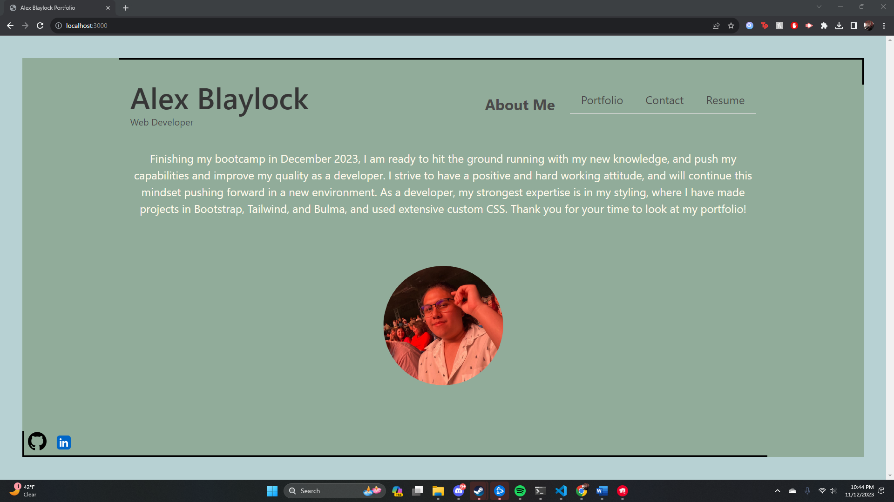

This is a portfolio I built using React! This is my first project in react so apologies for the crude setup.

I styled using Bulma CSS, and custom CSS.

This project had a lot of successes, I felt like implementing the styling on React has been a LOT easier then using Handlebars.

Some struggles I had were the routing (although this was still easier then Handlebars and API Routing), coming up with a good look for my page. I did decide to take some deducted points so that my
portfolio looks more to what *I* would want it to be. I did also struggle with my App.css not working quite how I wanted it to and I had to add essentially another css folder to do a lot of my custom css.
I think this will benefit more in the long run due to me not putting 2 projects that I feel like would be high enough quality to put on my portfolio.

Some future stuff I would like to implement: cleaner code, a better footer. I was trying to implement something to the bottom right of my portfolio, maybe a light/dark toggle in the future? I have some unused colors in my palette that I used and could use those, or get some new colors.

Thank you to: Tom Hearne and Matt Bronstein for teaching the class, and thank you to Nick Hanson for helping me get some ideas for my challenge.

link to site: https://6551b71eef6b6b0f38f303de--gleaming-pavlova-ddaf64.netlify.app/